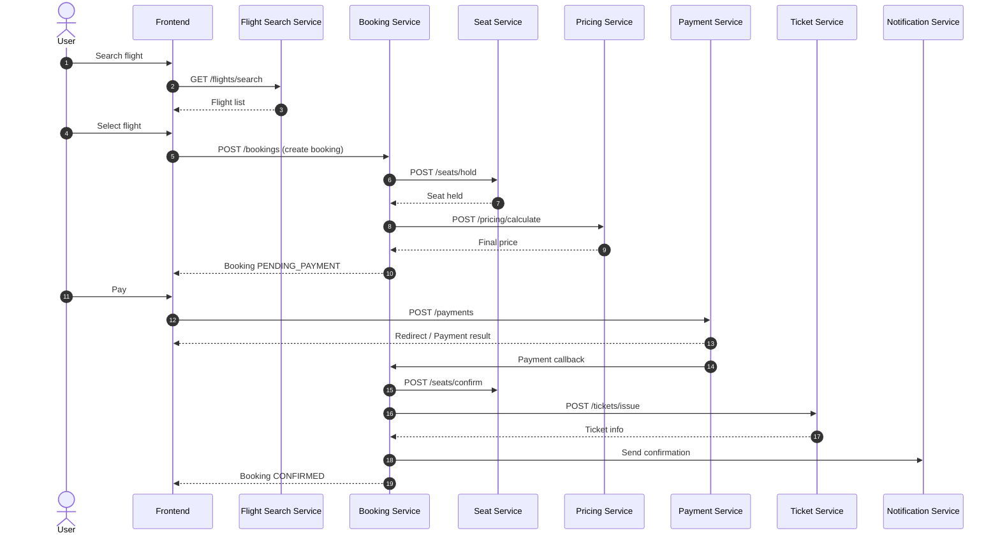

# Flight Booking Microservices – BA Specification

> Author: Business Analyst (BA)
> Scope: Booking flow, API contracts, Database schema
> Architecture: Microservices

---

## 1. Booking – Sequence Diagram



---

## 2. API Contract per Service

---

### 2.1 Auth Service

```http
POST /auth/register
POST /auth/login
POST /auth/refresh
POST /auth/forgot-password
POST /auth/reset-password
```

---

### 2.2 User Service

```http
GET    /users/me
PUT    /users/me
GET    /users/me/bookings
POST   /users/passengers
GET    /users/passengers
```

---

### 2.3 Flight Search Service

```http
GET /flights/search?from=SGN&to=HAN&date=2025-01-01&passengers=2

Response:
{
  "flightId": "FL123",
  "airline": "Vietnam Airlines",
  "departureTime": "2025-01-01T08:00",
  "arrivalTime": "2025-01-01T10:00",
  "price": 120.00
}
```

---

### 2.4 Flight Management Service

```http
POST   /admin/flights
PUT    /admin/flights/{id}
DELETE /admin/flights/{id}
GET    /admin/flights
```

---

### 2.5 Booking Service

```http
POST /bookings
GET  /bookings/{id}
POST /bookings/{id}/cancel
```

Request create booking:

```json
{
  "flightId": "FL123",
  "passengers": ["P1", "P2"]
}
```

---

### 2.6 Seat Service

```http
GET  /seats?flightId=FL123
POST /seats/hold
POST /seats/confirm
POST /seats/release
```

---

### 2.7 Pricing Service

```http
POST /pricing/calculate
```

```json
{
  "flightId": "FL123",
  "passengers": 2,
  "promoCode": "NEWYEAR"
}
```

---

### 2.8 Payment Service

```http
POST /payments
POST /payments/callback
POST /payments/refund
```

---

### 2.9 Ticket Service

```http
POST /tickets/issue
GET  /tickets/{ticketNumber}
```

---

### 2.10 Notification Service

```http
POST /notifications/email
POST /notifications/sms
```

---

## 3. Database Schema Design

---

### 3.1 User DB

```sql
users(
  id UUID PK,
  email VARCHAR UNIQUE,
  password_hash,
  status,
  created_at
)

passengers(
  id UUID PK,
  user_id FK,
  full_name,
  dob,
  passport_number
)
```

---

### 3.2 Flight DB

```sql
flights(
  id UUID PK,
  airline,
  origin,
  destination,
  departure_time,
  arrival_time,
  base_price,
  status
)

seats(
  id UUID PK,
  flight_id FK,
  seat_number,
  class,
  status
)
```

---

### 3.3 Booking DB

```sql
bookings(
  id UUID PK,
  user_id FK,
  flight_id FK,
  status,
  total_price,
  expired_at,
  created_at
)

booking_passengers(
  booking_id FK,
  passenger_id FK
)
```

---

### 3.4 Payment DB

```sql
payments(
  id UUID PK,
  booking_id FK,
  amount,
  method,
  status,
  transaction_id
)
```

---

### 3.5 Ticket DB

```sql
tickets(
  id UUID PK,
  booking_id FK,
  passenger_id FK,
  seat_id FK,
  ticket_number,
  qr_code,
  issued_at
)
```

---

### 3.6 Audit & Event (Optional)

```sql
events(
  id UUID PK,
  type,
  payload JSON,
  created_at
)
```

---

## 4. Notes for Developers

* Booking + Seat + Payment dùng **Saga Pattern**
* Payment callback phải **idempotent**
* Seat hold timeout xử lý bằng **scheduler / message queue**
* Search service nên dùng **read-optimized DB (CQRS)**

---

## 5. Next Possible Extensions

* Loyalty points service
* Multi-leg flights
* Dynamic pricing
* Overbooking strategy

---

## 6. Unified Database Design (Single DB)

> Database: **MySQL** (logical separation by schema / table prefix)

### 6.1 Core Tables

```sql
users(
  id CHAR(36) PK,
  email VARCHAR(255) UNIQUE,
  password_hash VARCHAR(255),
  status VARCHAR(50),
  created_at TIMESTAMP
)

roles(
  id INT PK,
  name VARCHAR(50)
)

user_roles(
  user_id CHAR(36) FK,
  role_id INT FK
)
```

```sql
flights(
  id CHAR(36) PK,
  airline VARCHAR(100),
  origin VARCHAR(10),
  destination VARCHAR(10),
  departure_time DATETIME,
  arrival_time DATETIME,
  base_price DECIMAL(10,2),
  status VARCHAR(50)
)

seats(
  id CHAR(36) PK,
  flight_id CHAR(36) FK,
  seat_number VARCHAR(5),
  class VARCHAR(20),
  status VARCHAR(20)
)
```

```sql
bookings(
  id CHAR(36) PK,
  user_id CHAR(36) FK,
  flight_id CHAR(36) FK,
  status VARCHAR(50),
  total_price DECIMAL(10,2),
  expired_at DATETIME,
  created_at TIMESTAMP
)

booking_passengers(
  booking_id CHAR(36) FK,
  passenger_name VARCHAR(255),
  passport_number VARCHAR(50)
)
```

```sql
payments(
  id CHAR(36) PK,
  booking_id CHAR(36) FK,
  amount DECIMAL(10,2),
  method VARCHAR(50),
  status VARCHAR(50),
  transaction_id VARCHAR(255)
)
```

```sql
tickets(
  id CHAR(36) PK,
  booking_id CHAR(36) FK,
  seat_id CHAR(36) FK,
  ticket_number VARCHAR(50),
  issued_at TIMESTAMP
)
```

```sql
saga_transactions(
  saga_id CHAR(36) PK,
  booking_id CHAR(36),
  current_step VARCHAR(50),
  status VARCHAR(50),
  created_at TIMESTAMP
)
```

---

## 7. Saga Design – Booking Saga

### 7.1 Saga Steps

1. **Create Booking**
2. **Hold Seat**
3. **Calculate Price**
4. **Create Payment**
5. **Confirm Seat**
6. **Issue Ticket**

---

### 7.2 Saga Orchestration (Booking Service)

```text
START
 → BOOKING_CREATED
 → SEAT_HELD
 → PRICE_CALCULATED
 → PAYMENT_SUCCESS
 → SEAT_CONFIRMED
 → TICKET_ISSUED
 → END
```

---

### 7.3 Compensation Actions

| Step Failed  | Compensation                  |
| ------------ | ----------------------------- |
| Seat Hold    | Cancel Booking                |
| Payment      | Release Seat                  |
| Ticket Issue | Refund Payment + Release Seat |

---

### 7.4 RabbitMQ Events

```text
booking.created
seat.hold.requested
seat.hold.failed
payment.success
payment.failed
ticket.issued
```

---

## 8. Tech Stack Architecture

| Layer         | Technology           |
| ------------- | -------------------- |
| API Gateway   | Spring Cloud Gateway |
| Auth          | Keycloak             |
| Backend       | Spring Boot          |
| Messaging     | RabbitMQ             |
| Database      | MySQL                |
| Observability | Zipkin + Prometheus  |

---

## 9. Authorization Service (with Keycloak)

### 9.1 Responsibilities

* Integrate Keycloak
* Validate JWT token
* Role & permission checking
* Provide user context to services

---

### 9.2 API Contracts

```http
POST /auth/introspect
Authorization: Bearer <token>
```

Response:

```json
{
  "active": true,
  "userId": "uuid",
  "roles": ["USER", "ADMIN"]
}
```

---

```http
GET /auth/me
Authorization: Bearer <token>
```

```json
{
  "userId": "uuid",
  "email": "user@email.com",
  "roles": ["USER"]
}
```

---

```http
POST /auth/authorize
```

```json
{
  "resource": "BOOKING",
  "action": "CREATE"
}
```

Response:

```json
{
  "allowed": true
}
```

---

### 9.3 Keycloak Configuration

* Realm: flight-booking
* Clients:

    * frontend-app
    * api-gateway
* Roles:

    * USER
    * ADMIN
    * AIRLINE_STAFF

---

### 9.4 Security Flow

1. User login → Keycloak
2. Receive JWT
3. API Gateway validates JWT
4. Forward user context to services
5. Authorization service validates permission

---

**End of document**
